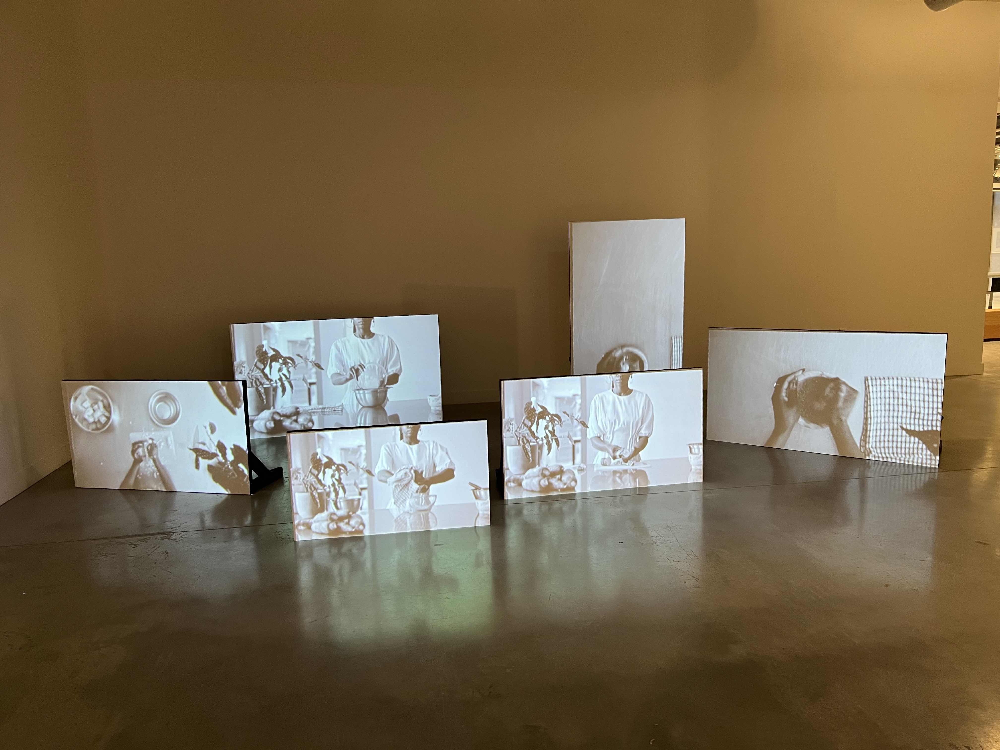

# Sylvie François

Photo de moi via une installation de Kosisochukwu Nnebe, *an inheritance - a threat - a haunting*, Biennale Afflux, décembre 2023

## **Intérêts dans le multimedia**
J'aime particulièrement les oeuvres d'art et j'apprécie l'art numérique qui utilise les codes ou outils technologiques pour en faire une poésie de sons et images.  
J'ai un faible pour les artistes qui combinent dans leur installation des oeuvres physiques et médiatiques pour tisser une narration, souvent à contenu social, comme *VahMiré*
Les médiatrices de la Fondation Phi expliquent la multiplicité de son approche dans l'expostion *Conditions d'utilisation* présentée en juin 2023.

<https://www.youtube.com/watch?v=ovc3ty_vqG0>

## Ce qui me plait dans l'introduction à la muséologie en TIM
Partager avec les étudiant.e.s des expériences permettant de poser un regard large sur l'expérience vécue par les spectacteurs qui perçoivent l'oeuvre ou le dispositif dans un contexte d'exposition.  
Apprendre à s'intéresser à toutes les composantes physiques et techniques qui interviennent dans la réception de la création.

![TEXTE QUE VOUS DÉSIREZ ICI](chemin vers la capture d'écran que vous avez mise dans un dossier de votre répertoire]

>💡 **Astuce** N'oubliez pas de vérifier la dimension de vos photos!
